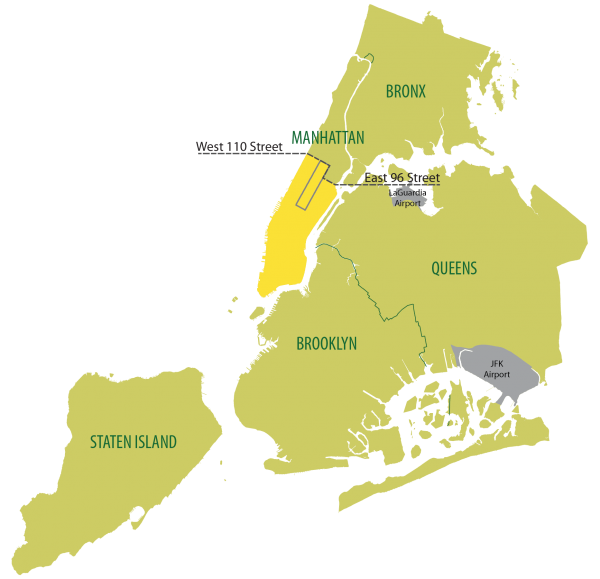

# Green Borough Taxi Analysis

Hi everyone, in this project i will try to discover hidden pattern and insights from the NYC borough taxi trip data by performing data analysis, these findings can be used by taxi cab companies or even individual drivers to improve their profit or minimize operating cost.

# Source Data 

The main data that being used in this analysis was gained from the New York City Taxi and Limousine Commission (NYC TLC), each rows represent a green taxi trip. the secondary data that being used was gained from the nyc open data which contains information of trip location and shape data.

# Business Understanding

Boro taxis or green taxi are taxicabs in New York City that are allowed to pick up passengers (street hails or calls) in outer boroughs (excluding John F. Kennedy International Airport and LaGuardia Airport unless arranged in advance) and in Manhattan above East 96th and West 110th Streets.

# Problems to be solved

After diving into the bussiness process, here are some problems that i can help to solve by using the data:
<ol>
  <li>When is the best time to allocate the taxi fleet or drive a taxi?</li>
  <li>Is the borough taxi distribution to other borough is even? </li>
  <li>How to improve the borough taxi business in other borough ?</li>
</ol>

# Data Cleaning

Data cleaning plays a pivotal role in data analysis as the quality and validity of insights are very dependant on data cleaning
<ol>
  <li> Handling Missing Values ?</li>
  <li> Outlier Identification </li>
  <li>How to improve the borough taxi business in other borough ?</li>
</ol>

## Missing Values

The data have 7 columns with missing value, The column "ehail_fee" has all it's value missing, while other columun has an average of 6.35% missing value.The column "ehail_fee" is dropped because all of it's value are missing The rows with missing values are dropped because imputation would probably lead to bias and there are no patterns in these missing value beside it happens in the same observation.

# Data Analysis

# Peak Day Analysis

# Peak Hour Analysis

# Trip Location Analysis

# Trip Route Analysis

# Trip Characteristic by Borough Analysis

# Reccomendation and conclusion

<ul>
  <li>It's recomended to allocate taxi fleet in the weekdays especially on wednesday, Thursday and friday's rush hour because the taxi demand on the peroids are high and allocate less fleet on sunday to reduce operating cost</li>
  <li>The popularity of green taxi on other borough besides manhattan is still low, especially in staten island and Bronx, the taxi also rarely used to travel between borough, this is because customer in these borough uses taxi for longer duration and farther distance than in manhattan, recalibartaion of taxi's fare rate to make it affordable in these borough or giving discount would increase the trip's number</li>
</ul>
